# Purchase Request Process Flow Chart

## Introduction

This document provides a comprehensive visualization of the complete Purchase Request (PR) lifecycle in the 1PWR Procurement System. The flowchart details all possible paths a PR can take from initiation through completion, including:

- **Decision Points**: Business rules and validation checks
- **Personnel Roles**: Permission levels and their capabilities
- **Quote Requirements**: Threshold-based rules for vendor quotes
- **Loop Mechanisms**: Revision and resubmission workflows
- **Termination Points**: Completion, cancellation, and rejection

## Process Flow Diagram

```mermaid
flowchart TB
    Start([User Creates PR])
    
    %% Initial Creation & Validation
    Start --> ValidateBasic{Validate Basic Info}
    ValidateBasic -->|Invalid| ValidationError[Show Validation Errors]
    ValidationError --> Start
    
    ValidateBasic -->|Valid| ValidateLineItems{At least 1 line item?}
    ValidateLineItems -->|No| ValidationError
    ValidateLineItems -->|Yes| CheckVehicle{Expense Type = Vehicle?}
    
    CheckVehicle -->|Yes| ValidateVehicle{Vehicle Selected?}
    ValidateVehicle -->|No| ValidationError
    ValidateVehicle -->|Yes| CreatePR[Create PR in Database]
    CheckVehicle -->|No| CreatePR
    
    CreatePR --> SetStatusSubmitted[Status: SUBMITTED]
    SetStatusSubmitted --> NotifyProcurement[Notify Procurement Team]
    NotifyProcurement --> ProcReview{Procurement Review<br/>Status: SUBMITTED}
    
    %% Procurement Edit Capability Loop
    ProcReview -->|Edit PR| EditPR[Edit PR Fields<br/>Can edit: Organization, Dept,<br/>Description, Site, Amount, etc.<br/>Cannot edit: Created by/date,<br/>Urgency, Required date]
    EditPR --> ProcReview
    
    %% Procurement Options from SUBMITTED
    ProcReview -->|Option 1: Move to Queue| MoveToQueue[Status: IN_QUEUE]
    ProcReview -->|Option 2: Request Revision| ValidateRevisionNotes{Notes<br/>Provided?}
    ProcReview -->|Option 3: Cancel PR| ValidateCancelNotes{Notes<br/>Provided?}
    
    ValidateRevisionNotes -->|No| ProcReview
    ValidateRevisionNotes -->|Yes| ProcRevise[Status: REVISION_REQUIRED]
    ValidateCancelNotes -->|No| ProcReview
    ValidateCancelNotes -->|Yes| Cancel[Status: CANCELED]
    
    %% Notify requestor for revision or cancellation
    ProcRevise --> NotifyRevision1[Notify Requestor]
    Cancel --> NotifyCancel[Notify Requestor]
    
    %% IN_QUEUE Processing
    MoveToQueue --> InQueueReview{Procurement Review<br/>Status: IN_QUEUE}
    InQueueReview -->|Push to Approver| DetermineThreshold{Determine Quote<br/>Requirements}
    
    %% Quote Requirements Logic
    DetermineThreshold --> CheckRule2{Amount ><br/>Rule 2 Threshold?}
    
    CheckRule2 -->|Above| Rule2Above[Require: 3 quotes<br/>with attachments<br/>Level 2 approver only]
    CheckRule2 -->|Below| CheckRule1{Amount ><br/>Rule 1 Threshold?}
    
    CheckRule1 -->|Above| CheckApprovedVendor1{Using Approved<br/>Vendor?}
    CheckApprovedVendor1 -->|Yes| Rule1AboveApproved[Require: 1 quote<br/>with attachment<br/>Level 2 approver only]
    CheckApprovedVendor1 -->|No| Rule1AboveNonApproved[Require: 3 quotes<br/>with attachments<br/>Level 2 approver only]
    
    CheckRule1 -->|Below| CheckApprovedVendor2{Using Approved<br/>Vendor?}
    CheckApprovedVendor2 -->|Yes| Rule1BelowApproved[Require: 1 quote<br/>attachment optional<br/>Level 4 or Level 2 approver]
    CheckApprovedVendor2 -->|No| Rule1BelowNonApproved[Require: 1 quote<br/>with attachment<br/>Level 4 or Level 2 approver]
    
    %% All paths converge to validation
    Rule2Above --> ValidateQuotes{Quotes Valid?}
    Rule1AboveApproved --> ValidateQuotes
    Rule1AboveNonApproved --> ValidateQuotes
    Rule1BelowApproved --> ValidateQuotes
    Rule1BelowNonApproved --> ValidateQuotes
    
    ValidateQuotes -->|Invalid/Incomplete| QuoteError[Notify: Additional<br/>quotes required]
    QuoteError --> InQueueReview
    ValidateQuotes -->|Valid| SelectApprover[Select Appropriate<br/>Approver]
    
    %% Approver Selection
    SelectApprover --> CheckApproverLevel{Check Approver<br/>Permission Level}
    CheckApproverLevel -->|Validate| CheckApproverOrg{Approver matches<br/>PR organization?}
    CheckApproverOrg -->|No| ApproverError[Error: Invalid<br/>approver selection]
    ApproverError --> InQueueReview
    CheckApproverOrg -->|Yes| CheckApproverActive{Approver<br/>is active?}
    CheckApproverActive -->|No| ApproverError
    CheckApproverActive -->|Yes| CheckSelfApproval{Approver is<br/>requestor?}
    CheckSelfApproval -->|Yes| ApproverError
    CheckSelfApproval -->|No| PushToApprover[Status: PENDING_APPROVAL]
    
    PushToApprover --> NotifyApprover[Notify Approver<br/>CC: Requestor]
    NotifyApprover --> ApproverReview{Approver Review}
    
    %% Approver Actions
    ApproverReview -->|Option 1: Approve| ApproveAction[Status: APPROVED]
    ApproverReview -->|Option 2: Reject| ApproveReject[Status: REJECTED]
    ApproverReview -->|Option 3: Request Revision| ApproveRevise[Status: REVISION_REQUIRED]
    
    %% Approved Path
    ApproveAction --> NotifyApproved[Notify Procurement<br/>& Requestor]
    NotifyApproved --> ProcurementOrder{Procurement<br/>Places Order}
    ProcurementOrder --> OrderPlaced[Status: ORDERED]
    
    %% Order Fulfillment
    OrderPlaced --> ReceiveItems{Receive Items}
    ReceiveItems -->|Partial Delivery| PartialReceived[Status: PARTIALLY_RECEIVED]
    PartialReceived --> CheckAllReceived{All Items<br/>Received?}
    CheckAllReceived -->|No| PartialReceived
    CheckAllReceived -->|Yes| Completed[Status: COMPLETED]
    ReceiveItems -->|Full Delivery| Completed
    
    %% Revision Loop (from Approver)
    ApproveRevise --> NotifyRevision2[Notify Requestor]
    NotifyRevision2 --> RequestorRevise2{Requestor<br/>Revises PR}
    
    %% Revision Loop (from Procurement already handled above)
    NotifyRevision1 --> RequestorRevise1{Requestor<br/>Revises PR}
    
    RequestorRevise1 -->|Resubmit| Resubmitted1[Status: RESUBMITTED]
    RequestorRevise1 -->|Cancel Instead| CancelFromRevision[Status: CANCELED]
    RequestorRevise2 -->|Resubmit| Resubmitted2[Status: RESUBMITTED]
    RequestorRevise2 -->|Cancel Instead| CancelFromRevision
    
    Resubmitted1 --> NotifyResubmit1[Notify Procurement]
    Resubmitted2 --> NotifyResubmit2[Notify Procurement]
    NotifyResubmit1 --> ProcReview
    NotifyResubmit2 --> ProcReview
    
    CancelFromRevision --> NotifyCancelFromRevision[Notify Procurement]
    NotifyCancelFromRevision --> CanceledEnd
    
    %% Rejection Endpoints (from Approver only)
    ApproveReject --> NotifyReject[Notify Requestor<br/>& Procurement]
    NotifyReject --> RejectedEnd([End: REJECTED])
    
    %% Cancellation Endpoint (from Procurement during SUBMITTED review)
    NotifyCancel --> CanceledEnd([End: CANCELED])
    
    %% Completion Endpoint
    Completed --> NotifyComplete[Notify All<br/>Stakeholders]
    NotifyComplete --> CompletedEnd([End: COMPLETED])
    
    %% Styling
    classDef submitStatus fill:#e3f2fd,stroke:#1976d2,stroke-width:2px
    classDef queueStatus fill:#fff3e0,stroke:#f57c00,stroke-width:2px
    classDef approvalStatus fill:#fce4ec,stroke:#c2185b,stroke-width:2px
    classDef approvedStatus fill:#e8f5e9,stroke:#388e3c,stroke-width:2px
    classDef rejectedStatus fill:#ffebee,stroke:#d32f2f,stroke-width:2px
    classDef completedStatus fill:#c8e6c9,stroke:#2e7d32,stroke-width:3px
    classDef decision fill:#fff9c4,stroke:#f9a825,stroke-width:2px
    classDef notification fill:#e1bee7,stroke:#8e24aa,stroke-width:2px
    classDef error fill:#ffcdd2,stroke:#c62828,stroke-width:2px
    classDef editAction fill:#bbdefb,stroke:#1565c0,stroke-width:2px,stroke-dasharray: 5 5
    
    class SetStatusSubmitted submitStatus
    class MoveToQueue,InQueueReview queueStatus
    class PushToApprover,NotifyApprover,ApproverReview approvalStatus
    class ApproveAction,NotifyApproved,ProcurementOrder,OrderPlaced,PartialReceived approvedStatus
    class ApproveReject,ProcRevise,ApproveRevise,RejectedEnd,Cancel,CancelFromRevision rejectedStatus
    class Completed,CompletedEnd completedStatus
    class ValidateBasic,ValidateLineItems,CheckVehicle,ValidateVehicle,ProcReview,ValidateRevisionNotes,ValidateCancelNotes,InQueueReview,DetermineThreshold,CheckRule2,CheckRule1,CheckApprovedVendor1,CheckApprovedVendor2,ValidateQuotes,CheckApproverLevel,CheckApproverOrg,CheckApproverActive,CheckSelfApproval,ReceiveItems,CheckAllReceived,RequestorRevise1,RequestorRevise2 decision
    class NotifyProcurement,NotifyApprover,NotifyApproved,NotifyRevision1,NotifyRevision2,NotifyResubmit1,NotifyResubmit2,NotifyReject,NotifyCancel,NotifyCancelFromRevision,NotifyComplete notification
    class ValidationError,QuoteError,ApproverError error
    class EditPR editAction
```

## Legend

### Status Colors
- **Blue** (Light): SUBMITTED status
- **Blue** (Light, Dashed Border): Edit actions (procurement can edit PR fields)
- **Orange** (Light): IN_QUEUE status
- **Pink** (Light): PENDING_APPROVAL status
- **Green** (Light): APPROVED, ORDERED, PARTIALLY_RECEIVED statuses
- **Red** (Light): REJECTED, REVISION_REQUIRED statuses
- **Green** (Dark): COMPLETED status (final state)
- **Yellow** (Light): Decision points and validation checks
- **Purple** (Light): Notification actions
- **Red** (Light): Error states

### Symbols
- **Rectangle**: Process or action step
- **Diamond**: Decision point or conditional check
- **Rounded Rectangle**: Start/End points
- **Arrows**: Flow direction and transitions

### Personnel & Permission Levels

| Level | Role | Capabilities in PR Workflow |
|-------|------|----------------------------|
| **Level 1** | Administrator (ADMIN) | Full system access; can manage all PRs; can cancel any PR |
| **Level 2** | Senior Approver | Can approve PRs of any value; required for high-value PRs (above thresholds) |
| **Level 3** | Procurement Officer (PROC) | Manages procurement process; pushes PRs to approvers; can reject or request revision |
| **Level 4** | Finance Admin (FIN_AD) | Can approve PRs below Rule 1 threshold only; has financial oversight |
| **Level 5** | Requester (REQ) | Creates and submits PRs; can view own PRs; can cancel own PRs |

## Key Business Rules

### 1. Procurement Review & Editing Permissions

**During SUBMITTED Status:**
- Procurement team reviews PR while status remains SUBMITTED
- Procurement can edit most fields **EXCEPT**:
  - Created by (requestor)
  - Created date
  - Last updated
  - Urgency level
  - Required date

**Procurement can edit:**
- Organization
- Department
- Description
- Site
- Estimated amount
- Currency
- Preferred vendor
- Line items (add, edit, delete)
- Attachments
- Any other non-canonical fields

**Procurement CANNOT edit (Finance/Admin only):**
- Project Category
- Expense Type

**Three Possible Outcomes from SUBMITTED:**
1. **Move to IN_QUEUE** - PR proceeds to quote validation and approver assignment
2. **Request Revision** (REVISION_REQUIRED) - Requires notes; notifies requestor
3. **Cancel PR** (CANCELED) - Requires notes; notifies requestor; PR not deleted from database

### 2. Quote Requirements

#### Rule 1 (Lower Threshold)
**Below Threshold:**
- Requires 1 quote
- Attachment optional
- Can be approved by Level 4 or Level 2 approvers
- **Supplier Data Requirement (collected in Stage 3 - IN_QUEUE):**
  - If **approved vendor**: Vendor data referenced from system
  - If **NOT approved vendor**: Procurement must input:
    - Supplier name (required)
    - Contact info: phone OR email OR website (at least one)
    - Validated before moving to PENDING_APPROVAL

**Above Threshold:**
- Requires 3 quotes with attachments
- Exception: Approved vendor requires only 1 quote with attachment
- Only Level 2 approvers can approve

#### Rule 2 (Higher Threshold)
**Below Threshold:**
- Rule 1 applies

**Above Threshold:**
- Always requires 3 quotes with attachments
- Requires TWO Level 2 approvers (concurrent approval - both notified simultaneously)
- No exceptions for approved vendors
- Both approvers must approve for PR to proceed to APPROVED status
- Approvers can review and act in any order
- If either approver rejects or requests revision, process stops immediately

### 2. Quote Validation Rules
- Quote amount used for threshold comparison is the **lowest valid quote amount**
- Each quote must include:
  - Valid amount
  - Currency
  - Vendor details
  - Attachment (except for approved vendors below Rule 1 threshold)
- Invalid quotes are not counted towards quote requirements
- All quote amounts are converted to the rule's base currency for comparison

### 3. Approver Selection Rules
- Approvers must be **active** (isActive = true)
- Approvers must have appropriate **permission level** (Level 2 or Level 4)
- Approvers must be assigned to the **same organization** as the PR
  - Includes primary organization or additional organizations
  - Organization IDs are normalized for matching (lowercase, underscores)
- Approvers **cannot approve their own PRs**
- Level 4 approvers can only approve PRs below Rule 1 threshold
- Level 2 approvers can approve PRs of any value

### 4. Validation Requirements
- **Email format**: Must be valid email address
- **Estimated Amount**: Must be greater than 0
- **Line Items**: At least one line item required with description, quantity, and UOM
- **Vehicle Field**: Required when Expense Type is "4 -Vehicle"
- **Approver Assignment**: At least one approver must be assigned
- **Currency**: Must match organization's allowed currencies

### 5. Status Transition Rules

**Standard Forward Flow:**
1. **User creates PR** → Validation → **SUBMITTED** (saved to database)
2. **SUBMITTED** → Procurement review (status remains SUBMITTED)
3. **SUBMITTED** → **IN_QUEUE** (procurement moves to queue)
4. **IN_QUEUE** → **PENDING_APPROVAL** (procurement pushes to approver after quote validation)
5. **PENDING_APPROVAL** → **APPROVED** (approver approves)
6. **APPROVED** → **ORDERED** (procurement places order)
7. **ORDERED** → **PARTIALLY_RECEIVED** or **COMPLETED**
8. **PARTIALLY_RECEIVED** → **COMPLETED** (all items received)

**Revision Loops:**
- **SUBMITTED** → **REVISION_REQUIRED** (procurement requests revision with notes)
- **PENDING_APPROVAL** → **REVISION_REQUIRED** (approver requests revision)
- **REVISION_REQUIRED** → **RESUBMITTED** (requestor revises and resubmits)
- **RESUBMITTED** → **SUBMITTED** (re-enters workflow at procurement review)

**Rejection Path:**
- **PENDING_APPROVAL** → **REJECTED** (approver rejects)

**Cancellation Paths:**
- **SUBMITTED** → **CANCELED** (procurement cancels with notes)
- **REVISION_REQUIRED** → **CANCELED** (requestor cancels instead of revising)
- Any status → **CANCELED** (requestor or admin cancels)

### 6. Notification Rules
All notifications are sent from **noreply@1pwrafrica.com**

**Trigger Points:**
- PR submission → Notify procurement team
- Push to approver → Notify assigned approver, CC requestor
- Approval → Notify procurement and requestor
- Rejection → Notify requestor and stakeholders
- Revision required → Notify requestor
- Resubmission → Notify procurement team
- Cancellation → Notify procurement and stakeholders
- Completion → Notify all stakeholders

**Subject Line Format:**
- Normal: "PR #[PR-NUMBER] - [STATUS]"
- Urgent: "URGENT: PR #[PR-NUMBER] - [STATUS]"

**Recipients:**
- Primary: Based on action (procurement, approver, requestor)
- CC: Always includes PR requestor
- Additional: Department head, previous approvers (as applicable)

### 7. Organization Assignment
- Users can have one primary organization
- Users can have additional organization assignments
- Organization IDs are normalized:
  - Converted to lowercase
  - Spaces and special characters replaced with underscores
  - Example: "1PWR LESOTHO" becomes "1pwr_lesotho"
- Organization matching uses normalized IDs

### 8. Data Model Key Fields
- **approver**: Single source of truth for current approver (user ID)
- **approvalWorkflow**: Tracks approval history and workflow changes
- **prNumber**: Format ORG-YYYYMM-XXX (auto-generated)
- **status**: Current PR status (see status transitions above)
- **estimatedAmount**: Total estimated cost
- **currency**: Currency code (LSL, USD, ZAR)
- **urgencyLevel**: Normal or Urgent
- **lineItems**: Array of requested items

## Workflow States Summary

### Active States (PR can transition)
1. **SUBMITTED** - Initial creation, awaiting procurement review (can be edited by procurement)
2. **IN_QUEUE** - Procurement is validating quotes and preparing for approver assignment
3. **PENDING_APPROVAL** - Awaiting approver decision
4. **APPROVED** - Approved, awaiting order placement
5. **ORDERED** - Order has been placed with vendor
6. **PARTIALLY_RECEIVED** - Some items delivered, waiting for rest
7. **RESUBMITTED** - Revised by requestor after revision request (returns to SUBMITTED)
8. **REVISION_REQUIRED** - Changes requested by procurement or approver, awaiting requestor action

### Terminal States (PR ends)
1. **COMPLETED** - All items received, PR closed successfully
2. **REJECTED** - PR rejected by approver (only approvers can reject)
3. **CANCELED** - PR canceled by procurement or requestor (not deleted from database)

## Notes

### Currency Conversion
- Each organization has a base currency defined in their rules
- All quote amounts are converted to the rule's currency for threshold comparison
- Conversion uses current exchange rates
- Threshold comparisons are made after currency conversion

### Historical Data Integrity
- Approved PRs maintain approver information even if:
  - Approver is later deactivated
  - Approver's organization assignments change
  - Approver's permission level changes
- This ensures audit trail integrity

### Attachment Requirements
Attachments are required for:
- All quotes above Rule 2 threshold
- All quotes above Rule 1 threshold (except approved vendors)
- All quotes below Rule 1 threshold from non-approved vendors

Attachments must be:
- Valid file format
- Readable
- Contains clear quote details and vendor information

---

**Document Version:** 1.0  
**Last Updated:** 2025-10-11  
**Based on:** Specifications.md (Updated 2025-01-15)

