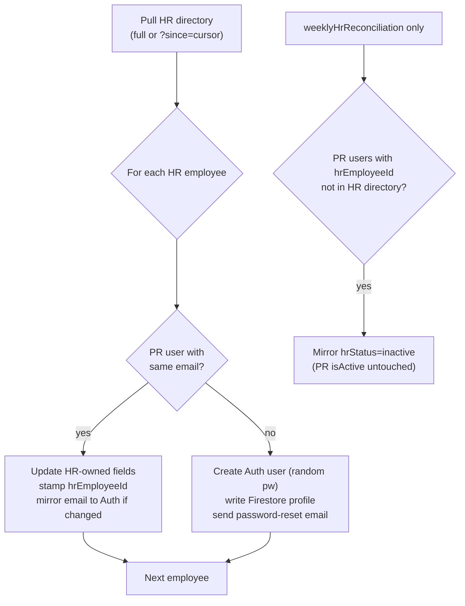

# HR Employee Metadata Sync

The 1PWR HR portal (`hr.1pwrafrica.com`) is the **canonical source of truth**
for 1PWR employee metadata. The PR System synchronizes from HR — never the
other way around. This document describes the contract, the data model, the
sync functions, and the operator runbook.

## Why

PR previously maintained its own employee database, which drifted from HR
(name spelling, department moves, departures, country transfers). Going
forward:

- HR owns biographical + employment metadata.
- PR owns PR-specific metadata (permission level, organization,
  additional organizations, active flag, HR-Lead role, multi-department
  appointments).
- Matching is by **email** (case-insensitive). Once matched, a PR user is
  stamped with `hrEmployeeId`, which becomes the durable link even if the
  user's email later changes.

## Data model

PR `users/<uid>` documents gain an HR-owned block (see
[src/types/user.ts](../src/types/user.ts)):

| Field                   | HR source                | Notes |
|-------------------------|--------------------------|-------|
| `hrEmployeeId`          | `employee_id`            | Durable link to HR |
| `hrStatus`              | `status`                 | `active` / `inactive` |
| `hrCountry`             | `country`                | ISO-2 code |
| `hrDepartmentName`      | `department`             | Name string from HR |
| `employeeType`          | `type`                   | e.g. "Full time – fixed contract" |
| `primaryDeployment`     | `primary_deployment`     | e.g. "Field", "Office" |
| `employmentStartDate`   | `employment_start_date`  | YYYY-MM-DD |
| `currentPositionTitle`  | `current_position_title` | |
| `phone`                 | `phone`                  | |
| `headshot`              | `headshot`               | URL |
| `hrLastUpdatedAt`       | `last_updated_at`        | HR's own mtime; sync cursor |
| `hrSyncedAt`            | —                        | When PR last synced this user |
| `firstName`/`lastName`  | `name` (split)           | Biographical, HR-owned once linked |
| `email`                 | `email`                  | Mirrored to Firebase Auth on change |
| `department`            | `department` (resolved)  | HR name → PR `referenceData_departments` doc id |

PR-owned fields (unchanged by sync): `permissionLevel`, `organization`,
`additionalOrganizations`, `isActive`, `isHrLead`, `hrLeadCountryCodes`,
`multiDepartmentAppointmentsEnabled`, `departmentMemberships`.

## Firestore rules

[firestore.rules](../firestore.rules) protects the HR-owned block: once a
user has a non-empty `hrEmployeeId`, client writes may not change any
HR-owned field. Cloud Functions write via the Admin SDK and bypass these
rules, so the sync functions can still update them.

New server-only collections:

- `hrReconciliationReports/<timestamp>` — one doc per sync run. Admin-read.
- `hrSyncState/cursor` — `lastUpdatedAt`, `lastFullSyncAt`,
  `lastIncrementalSyncAt`. Admin-read.

## Functions

All live under [functions/src/hr/](../functions/src/hr/):

| Export                       | Type      | Schedule / trigger            | Purpose |
|------------------------------|-----------|-------------------------------|---------|
| `nightlyHrEmployeeSync`      | scheduled | daily 02:00 Africa/Maseru     | Incremental pull (`?since=<cursor>`); upsert + provision |
| `weeklyHrReconciliation`     | scheduled | Mondays 06:30 Africa/Maseru   | Full pull; upsert + provision + **departure detection** |
| `runHrEmployeeSyncNow`       | callable  | admin-only                    | Ad-hoc incremental run from the UI |
| `reconcileHrEmployees`       | callable  | admin-only                    | Ad-hoc full reconciliation from the UI |
| `refreshUserFromHr`          | callable  | admin-only                    | Refresh/provision a single user by `employeeId` |
| `hrSmokeTest`                | callable  | admin-only                    | Verify key + egress from the running runtime |

Why two schedules: the HR `/directory` endpoint drops inactive rows, so an
incremental `?since=` pull cannot see departures. The weekly full diff
detects them by absence and mirrors `hrStatus: 'inactive'` (PR's own
`isActive` is never flipped automatically).

## Matching, provisioning, departures



Provisioning notes:

- New hires get `permissionLevel = 5` (Requester) and **no organization**.
  An admin must assign organization from the User Management screen before
  the user can raise PRs. The reconciliation report lists them.
- If an Auth account already exists for the email (an Auth orphan),
  provisioning adopts that uid and writes the Firestore profile instead of
  failing.
- A password-reset email is sent to the new user.

## Configuration

Set these in `functions/.env` (see [functions/.env.example](../functions/.env.example)):

```
HR_API_BASE_URL=https://hr.1pwrafrica.com
HR_API_KEY_PR_PORTAL=<issued by HR portal>
```

Deploy with `firebase functions:secrets:run` semantics — these are plain env
vars, read via `process.env`. Rotate by re-deploying with a new value.

## Operator runbook

### First-time reconciliation

1. Confirm `HR_API_KEY_PR_PORTAL` is set in `functions/.env` and deployed.
2. Run `hrSmokeTest` from the admin UI (or call the callable) to confirm
   the key works and egress to `hr.1pwrafrica.com` is allowed.
3. Run `reconcileHrEmployees` from the admin UI. This is the one-time
   reconciliation: it matches existing PR users to HR by email, stamps
   `hrEmployeeId`, overwrites HR-owned fields, provisions new hires, and
   writes a report to `hrReconciliationReports/<ts>`.
4. Review the report:
   - **Unmapped departments** — HR uses a department name with no matching
     PR `referenceData_departments` doc. Add or rename a department in PR,
     then re-run.
   - **Provisioned** — new accounts created. Assign `organization` to each
     from the User Management screen.
   - **Email-updated** — PR Auth emails changed to match HR. Users will need
     to sign in with the new email.
   - **Departures** — PR users with `hrEmployeeId` no longer in HR. Their
     `hrStatus` is now `inactive`; decide whether to also set PR `isActive`
     = false (manual, by an admin).
   - **PR-only** — PR users whose email is not in HR. Left untouched.
     Investigate if these are real 1PWR staff missing from HR, or
     non-1PWR accounts (contractors, service accounts).

A local equivalent is available at
[scripts/reconcile-hr-employees.ts](../scripts/reconcile-hr-employees.ts)
for offline review without deploying.

### Ongoing

- `nightlyHrEmployeeSync` runs daily at 02:00 and picks up HR changes.
- `weeklyHrReconciliation` runs Mondays at 06:30 and catches departures.
- Use **Refresh from HR** on a user's row in User Management to pull a
  single employee on demand (e.g. right after HR updates them).
- Use **Sync now** in User Management to trigger an ad-hoc incremental run.

## HR API contract (summary)

PR consumes three HR endpoints (see HR repo
`docs/HR_API_INTEGRATION.md` for the authoritative spec):

- `GET /api/employees/directory?country=&department=&since=` — list
  employees. `since` is an ISO-8601 timestamp; HR returns only rows with
  `last_updated_at >= since`.
- `GET /api/employees/meta` — list of countries and departments (not
  currently used by the sync, useful for diagnostics).
- `GET /api/employees/show/<employee_id>` — single employee, used by
  `refreshUserFromHr`.

Auth: `X-API-Key: <HR_API_KEY_PR_PORTAL>` header. Read-only server-to-server.

## Limits / non-goals

- PR does **not** write back to HR. If PR needs to change an employee's
  name or department, that change is made in HR and propagates to PR on
  the next sync.
- The sync does not delete PR Auth accounts for departed employees. It
  only mirrors `hrStatus`. Deactivating the PR account (and revoking
  sign-in) is a manual admin action.
- Provisioned users have no `organization` until an admin assigns one.
