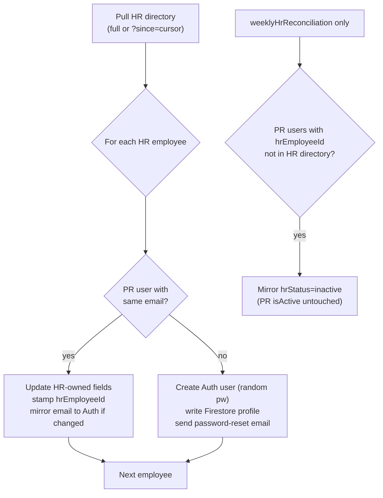

# HR Employee Metadata Sync

The 1PWR HR portal (`hr.1pwrafrica.com`) is the **canonical source of truth**
for 1PWR employee metadata. The PR System synchronizes from HR — never the
other way around. This document describes the contract, the data model, the
sync functions, and the operator runbook.

## Why

PR previously maintained its own employee database, which drifted from HR
(name spelling, department moves, departures, country transfers). Going
forward:

- HR owns biographical + employment metadata.
- PR owns PR-specific metadata (permission level, organization,
  additional organizations, active flag, HR-Lead role, multi-department
  appointments).
- Matching is by **email** (case-insensitive). Once matched, a PR user is
  stamped with `hrEmployeeId`, which becomes the durable link even if the
  user's email later changes.

## Data model

PR `users/<uid>` documents gain an HR-owned block (see
[src/types/user.ts](../src/types/user.ts)):

| Field                   | HR source                | Notes |
|-------------------------|--------------------------|-------|
| `hrEmployeeId`          | `employee_id`            | Durable link to HR |
| `hrStatus`              | `status`                 | `active` / `inactive` |
| `hrCountry`             | `country`                | ISO-2 code |
| `hrDepartmentName`      | `department`             | Name string from HR |
| `employeeType`          | `type`                   | e.g. "Full time – fixed contract" |
| `primaryDeployment`     | `primary_deployment`     | e.g. "Field", "Office" |
| `employmentStartDate`   | `employment_start_date`  | YYYY-MM-DD |
| `currentPositionTitle`  | `current_position_title` | |
| `phone`                 | `phone`                  | |
| `headshot`              | `headshot`               | URL |
| `hrLastUpdatedAt`       | `last_updated_at`        | HR's own mtime; sync cursor |
| `hrSyncedAt`            | —                        | When PR last synced this user |
| `firstName`/`lastName`  | `name` (split)           | Biographical, HR-owned once linked |
| `email`                 | `email`                  | Mirrored to Firebase Auth on change |
| `department`            | `department` (resolved)  | HR name → PR `referenceData_departments` doc id |

PR-owned fields (unchanged by sync): `permissionLevel`, `organization`,
`additionalOrganizations`, `isActive`, `isHrLead`, `hrLeadCountryCodes`,
`multiDepartmentAppointmentsEnabled`, `departmentMemberships`.

## Firestore rules

[firestore.rules](../firestore.rules) protects the HR-owned block: once a
user has a non-empty `hrEmployeeId`, client writes may not change any
HR-owned field. Cloud Functions write via the Admin SDK and bypass these
rules, so the sync functions can still update them.

New server-only collections:

- `hrReconciliationReports/<timestamp>` — one doc per sync run. Admin-read.
- `hrSyncState/cursor` — `lastUpdatedAt`, `lastFullSyncAt`,
  `lastIncrementalSyncAt`. Admin-read.

## Functions

All live under [functions/src/hr/](../functions/src/hr/):

| Export                       | Type      | Schedule / trigger            | Purpose |
|------------------------------|-----------|-------------------------------|---------|
| `nightlyHrEmployeeSync`      | scheduled | daily 02:00 Africa/Maseru     | Incremental pull (`?since=<cursor>`); upsert + provision |
| `weeklyHrReconciliation`     | scheduled | Mondays 06:30 Africa/Maseru   | Full pull; upsert + provision + **departure detection** |
| `runHrEmployeeSyncNow`       | callable  | admin-only                    | Ad-hoc incremental run from the UI |
| `reconcileHrEmployees`       | callable  | admin-only                    | Ad-hoc full reconciliation from the UI |
| `refreshUserFromHr`          | callable  | admin-only                    | Refresh/provision a single user by `employeeId` |
| `hrSmokeTest`                | callable  | admin-only                    | Verify key + egress from the running runtime |

Why two schedules: the HR `/directory` endpoint drops inactive rows, so an
incremental `?since=` pull cannot see departures. The weekly full diff
detects them by absence and mirrors `hrStatus: 'inactive'` (PR's own
`isActive` is never flipped automatically).

## Matching, provisioning, departures



Provisioning notes:

- New hires get `permissionLevel = 5` (Requester) and **no organization**.
  An admin must assign organization from the User Management screen before
  the user can raise PRs. The reconciliation report lists them.
- If an Auth account already exists for the email (an Auth orphan),
  provisioning adopts that uid and writes the Firestore profile instead of
  failing.
- A password-reset email is sent to the new user.

## Configuration

Set these in `functions/.env` (see [functions/.env.example](../functions/.env.example)):

```
HR_API_BASE_URL=https://hr.1pwrafrica.com
HR_API_KEY_PR_PORTAL=<issued by HR portal>
```

Deploy with `firebase functions:secrets:run` semantics — these are plain env
vars, read via `process.env`. Rotate by re-deploying with a new value.

## Operator runbook

### First-time reconciliation

1. Confirm `HR_API_KEY_PR_PORTAL` is set in `functions/.env` and deployed.
2. Run `hrSmokeTest` from the admin UI (or call the callable) to confirm
   the key works and egress to `hr.1pwrafrica.com` is allowed.
3. Run `reconcileHrEmployees` from the admin UI. This is the one-time
   reconciliation: it matches existing PR users to HR by email, stamps
   `hrEmployeeId`, overwrites HR-owned fields, provisions new hires, and
   writes a report to `hrReconciliationReports/<ts>`.
4. Review the report:
   - **Unmapped departments** — HR uses a department name with no matching
     PR `referenceData_departments` doc. Add or rename a department in PR,
     then re-run.
   - **Provisioned** — new accounts created. Assign `organization` to each
     from the User Management screen.
   - **Email-updated** — PR Auth emails changed to match HR. Users will need
     to sign in with the new email.
   - **Departures** — PR users with `hrEmployeeId` no longer in HR. Their
     `hrStatus` is now `inactive`; decide whether to also set PR `isActive`
     = false (manual, by an admin).
   - **PR-only** — PR users whose email is not in HR. Left untouched.
     Investigate if these are real 1PWR staff missing from HR, or
     non-1PWR accounts (contractors, service accounts).

A local equivalent is available at
[scripts/reconcile-hr-employees.ts](../scripts/reconcile-hr-employees.ts)
for offline review without deploying.

### Ongoing

- `nightlyHrEmployeeSync` runs daily at 02:00 and picks up HR changes.
- `weeklyHrReconciliation` runs Mondays at 06:30 and catches departures.
- Use **Refresh from HR** on a user's row in User Management to pull a
  single employee on demand (e.g. right after HR updates them).
- Use **Sync now** in User Management to trigger an ad-hoc incremental run.

## HR API contract (summary)

PR consumes three HR endpoints (see HR repo
`docs/HR_API_INTEGRATION.md` for the authoritative spec):

- `GET /api/employees/directory?country=&department=&since=` — list
  employees. `since` is an ISO-8601 timestamp; HR returns only rows with
  `last_updated_at >= since`.
- `GET /api/employees/meta` — list of countries and departments (not
  currently used by the sync, useful for diagnostics).
- `GET /api/employees/show/<employee_id>` — single employee, used by
  `refreshUserFromHr`.

Auth: `X-API-Key: <HR_API_KEY_PR_PORTAL>` header. Read-only server-to-server.

## Limits / non-goals

- PR does **not** write back to HR. If PR needs to change an employee's
  name or department, that change is made in HR and propagates to PR on
  the next sync.
- The sync does not delete PR Auth accounts for departed employees. It
  only mirrors `hrStatus`. Deactivating the PR account (and revoking
  sign-in) is a manual admin action.
- Provisioned users have no `organization` until an admin assigns one.

## Department catalog (HR canonical as of 2026-06-30)

As of 2026-06-30 HR is also the **canonical source of truth for the
department catalog** — not just employee metadata. PR is a consumer: it
mirrors HR's `GET /api/departments` into `referenceData_departments` and
resolves HR department names to PR doc ids against that mirror.

### Why

PR's catalog drifted from HR's after the one-time department seeding
(e.g. HR renamed "O&M" to "Operations & Maintenance", PR kept the old
name; HR deactivated a department, PR still had it active). HR also
introduced country-aware, per-organization departments that PR's flat
name list couldn't disambiguate. HR now owns the catalog; PR mirrors it.

### Data flow

```
HR MySQL (departments) ──> /api/departments ──> PR Cloud Functions
                                                      │
                                                      ▼
                          PR Firestore referenceData_departments (mirror)
                                                      │
                                                      ▼
                          departmentResolver (country, org, name)
                                                      │
                                                      ▼
                          hrEmployeeSync resolves HR dept name -> PR id
```

### Mirror fields on `referenceData_departments/<docId>`

| Field                | HR source        | Notes |
|----------------------|------------------|-------|
| `name`               | `name`           | |
| `code`               | derived          | `source_doc_id` slug, or slug of name; preserved on existing docs |
| `organization`/`organizationId` | `organization_id` | org name resolved from `referenceData_organizations` |
| `country`            | `country`        | ISO-2 |
| `active`             | `active`         | mirrored from HR; tombstoned rows set `active=false` |
| `sourceSystem`       | `source_system`  | `'pr'` / `'hr'` / `'hr_renamed'` |
| `sourceDocId`        | `source_doc_id`  | HR's external doc id — for `source_system='pr'` this equals the PR doc id (preserves existing FKs) |
| `hrId`               | `id`             | HR MySQL primary key |
| `aliases`            | `aliases`        | Alternate names (exposed by HR when B3 of the toolset spec lands) |
| `hrCatalogSyncedAt`  | —                | When PR last mirrored this row |
| `updatedAt`          | —                | PR mtime |

### Cloud functions

- `nightlyDepartmentCatalogSync` — pubsub `0 1 * * *` Africa/Maseru,
  runs **before** the 02:00 employee sync so the resolver has fresh data.
  Full sync (with tombstoning).
- `runDepartmentCatalogSyncNow` — admin callable, **incremental**
  (`?since=<cursor>`), no tombstoning.
- `reconcileDepartmentCatalog` — admin callable, **full** (with tombstoning).

Reports land in `hrDepartmentSyncReports/<ts>` (admin-read, server-write).
Cursor lives in `hrSyncState/departmentCursor`
(`lastUpdatedAt`, `lastFullSyncAt`, `lastIncrementalSyncAt`).

### Matching / upsert key

The upsert key is HR's `source_doc_id`:

- `source_system='pr'` → `source_doc_id` **is** the PR Firestore doc id;
  we update that doc in place. This preserves every existing FK on PRs
  and users that points at the department.
- `source_system in ('hr','hr_renamed')` → upsert a doc whose id is the
  HR `source_doc_id` (slug-safe), creating it if absent.

### Tombstoning

A **full** sync sets `active=false` on any `referenceData_departments`
doc that (a) carries a `sourceDocId` (provenance-tracked) and (b) is
absent from HR's response. PR-native docs with no `sourceDocId` are
left alone and flagged in the report as `prNativeUntouched` — they
predate the HR-canonical switch and may be genuinely PR-only; an admin
should decide whether to retcon a `source_doc_id` onto them or delete
them.

### Resolver

[`functions/src/hr/departmentResolver.ts`](../functions/src/hr/departmentResolver.ts)
was rewritten to match by `(country, organizationId, name)` with
fallbacks to `(country, name)`, `(organizationId, name)`, then `(name)`.
Only active departments are eligible. The employee sync passes the
employee's HR `country` to the resolver (HR's directory API exposes
country but not `organization_id` per employee, so the
`(country, name)` tier is what unblocks the multi-org-per-country
ambiguity HR API doc §12 calls out). Aliases are indexed alongside the
primary name.

### PR admin UI

The Departments tab in
[`src/components/admin/ReferenceDataManagement.tsx`](../src/components/admin/ReferenceDataManagement.tsx)
is now **read-only**: Add / Edit / Delete / Import-from-Organization are
hidden, and a banner points admins at the HR portal. The list, org
filter, and table remain. This enforces HR API doc §12's "do not push
department edits from PR back to HR" rule.

`firestore.rules` makes `referenceData_departments` **server-write only**
(`allow write: if false`); the Admin SDK bypasses rules, so Cloud
Functions can still write.

### Multi-department memberships

Multi-department memberships (a user belonging to 2–3 departments with
one primary, plus Lead flags) remain **PR-owned** until HR ships the
toolset described in [`HR_DEPARTMENT_TOOLSET_MIGRATION_SPEC.md`](./HR_DEPARTMENT_TOOLSET_MIGRATION_SPEC.md).
Once HR exposes `memberships[]` on `/api/employees/directory`, PR's
employee sync will switch to consuming them from HR and stop owning
them. That's a future PR-side change, tracked in the spec's §5.

### Local runner

```bash
# Workaround for Node 26 + firebase-admin (see scripts/_slowbuffer-polyfill.cjs):
cp scripts/_slowbuffer-polyfill.cjs /tmp/_slowbuffer-polyfill.cjs
NODE_OPTIONS="--require /tmp/_slowbuffer-polyfill.cjs" npm run sync-department-catalog            # full
NODE_OPTIONS="--require /tmp/_slowbuffer-polyfill.cjs" npm run sync-department-catalog -- --dry-run
NODE_OPTIONS="--require /tmp/_slowbuffer-polyfill.cjs" npm run sync-department-catalog -- --incremental
```

## Countries & organizations (PR canonical as of 2026-07-01)

PR is the **canonical source of truth for countries and organizations** —
the inverse direction of the department catalog. Organizations are
children of countries: each organization carries a `countryCode` (ISO-2)
linking to its parent country in `referenceData_countries`. HR pulls both
lists from PR's read-only catalog API to replace its static
`config/pr_org_map.php` (see [`HR_ORG_COUNTRY_SYNC_SPEC.md`](./HR_ORG_COUNTRY_SYNC_SPEC.md)).

### Data model

`referenceData_countries/<ISO-2>` (e.g. `LS`, `BJ`, `ZM`):

| Field    | Notes |
|----------|-------|
| `code`   | ISO-2 country code; also the doc id |
| `name`   | Display name ("Lesotho") |
| `active` | Admin can deactivate a country without deleting |

`referenceData_organizations/<org_id>` gains:

| Field         | Notes |
|---------------|-------|
| `countryCode` | ISO-2 link to `referenceData_countries` (canonical) |
| `country`     | Display name, kept in sync with the selected country for backward-compat display |

### Admin UI

- A new **Countries** reference-data type with full CRUD (admin-only):
  ISO-2 code, name, active. Countries are org-independent.
- The **Organizations** form's Country field is now a selector populated
  from `referenceData_countries`; picking a country sets both
  `countryCode` (ISO-2) and `country` (display name) on the org.

### PR → HR catalog API

`functions/src/prCatalogApi.ts` exposes a server-to-server HTTPS endpoint
(`prCatalogApi` Cloud Function):

- `GET /api/countries` → `{ count, countries: [{ code, name, active }] }`
- `GET /api/organizations?country=LS` →
  `{ count, organizations: [{ id, name, countryCode, country, currency, timezoneOffset, active }] }`

Auth: `X-API-Key: <HR_API_KEY_PR_PORTAL>` — the **same key** HR issues for
its own API and PR already stores in `functions/.env`. Reused in both
directions by explicit decision. Responses are `Cache-Control: no-store`.

HR consumes this with a Laravel console command that replaces
`config/pr_org_map.php`; see the spec linked above.

### One-time seed + backfill

`scripts/seed-countries.ts` (run once) seeds `referenceData_countries`
(LS, ZM, BJ) and backfills `countryCode` on every existing
`referenceData_organizations` doc from the org-id → ISO-2 map that HR
previously kept in `config/pr_org_map.php`. Run with the same Node 26
polyfill workaround:

```bash
cp scripts/_slowbuffer-polyfill.cjs /tmp/_slowbuffer-polyfill.cjs
NODE_OPTIONS="--require /tmp/_slowbuffer-polyfill.cjs" npm run seed-countries -- --dry-run
NODE_OPTIONS="--require /tmp/_slowbuffer-polyfill.cjs" npm run seed-countries
```

